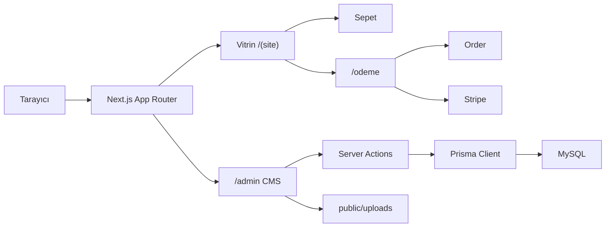
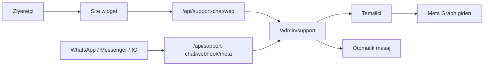

# Eticaret — Mağaza ve Yönetim Paneli

Next.js 15 tabanlı e-ticaret sitesi. Vitrinde katalog, sepet, ödeme ve üye hesabı; admin’de ürün, sipariş, müşteri ve CMS birlikte çalışır. Veri Prisma + MySQL üzerindedir.

[](https://nextjs.org/)
[](https://www.typescriptlang.org/)
[](https://www.prisma.io/)
[](https://tailwindcss.com/)
[](https://stripe.com/)

---

## Özellikler

### Mağaza

- Ürün kataloğu: kategori, marka, varyant, filtre, KDV, stok
- Sepet (`localStorage`) ve çok adımlı ödeme: adres → kargo → ödeme
- Ödeme yöntemleri: havale / EFT, kapıda ödeme, kredi kartı (Stripe)
- Üye hesabı: üyelik bilgileri, adres defteri, siparişler
- Özelleştirilebilir katalog URL’leri (ön ek + isteğe bağlı kalıcı sayısal ID)
- Tema, menü, hero, sayfa builder ve performans ayarları
- Lisanslı destek sohbeti: sitede web widget, WhatsApp / Messenger / Instagram DM

### Yönetim

- Velzon tarzı admin (sidebar, header, aydınlık / karanlık tema)
- Ürün, kategori, marka, tedarikçi, kargo, sipariş, müşteri
- Destek sohbeti: gelen kutusu, kanallar, mesai, otomatik mesajlar, çöp kutusu
- Personel yetkileri (görüntüleme / oluşturma / güncelleme / silme)
- CMS: sayfalar, hero, kartlar, SSS, menüler, blog, projeler, yapılan işler
- Site ayarları: genel, görünüm, iletişim, SEO, e-posta, üyelik, tema
- TipTap editör, görsel yükleme / kırpma (Sharp → WebP)

---

## Teknoloji yığını

| Katman | Seçim |
| --- | --- |
| Framework | Next.js 15 (App Router), React 19 |
| Dil | TypeScript |
| Stil | Tailwind CSS 4 |
| Veritabanı | MySQL / MariaDB (XAMPP) |
| ORM | Prisma 6 |
| Auth | Auth.js (next-auth v5) — JWT + Credentials, isteğe bağlı OAuth |
| Ödeme | Stripe Checkout + webhook |
| Editör | TipTap |
| Sıralama | @dnd-kit |
| Görsel | Sharp, react-easy-crop |

---

## Mimari



- **Vitrin** `src/app/(site)` — katalog, sepet, ödeme, üye alanı, CMS sayfaları
- **Admin** `src/app/admin` — `(auth)` login, `(panel)` korumalı yönetim
- **Middleware** `/admin`, `/uye`, `/odeme` ve üye giriş rotalarını korur
- **Sepet** tarayıcıda (`eticaret.cart.v1`); sipariş sunucuda oluşur

---

## Proje yapısı

```text
├── prisma/
│   ├── schema.prisma
│   ├── seed.ts
│   └── migrations/
├── public/uploads/           # yüklenen görseller (git’te yok)
├── scripts/                  # deploy ve yardımcı scriptler
└── src/
    ├── app/
    │   ├── (site)/           # vitrin, sepet, ödeme, üye, CMS
    │   ├── admin/(auth)/     # /admin/login
    │   ├── admin/(panel)/    # mağaza + CMS
    │   └── api/              # Auth.js, Stripe, e-posta, sohbet
    ├── components/
    │   ├── admin/
    │   └── site/             # header, sepet, ödeme, katalog, web sohbet
    ├── config/
    ├── modules/support-chat/ # gelen kutusu, Meta, widget, otomatik yanıt
    ├── lib/                  # prisma, sepet, sipariş, URL, ayarlar
    ├── auth.ts
    └── middleware.ts
```

---

## Vitrin rotaları

Katalog ön ekleri **Ayarlar → SEO & Linkler** ile değişir. Varsayılanlar:

| Sayfa | Varsayılan adres |
| --- | --- |
| Katalog | `/katalog` |
| Ürün | `/{slug}` veya `/{slug}/{id}` |
| Kategori | `/kategori/{slug}` |
| Marka | `/marka/{slug}` |
| Sepet | `/sepet` |
| Ödeme | `/odeme?adim=adres` |
| Teşekkür | `/siparis/tesekkur/{referans}` |
| Hesabım | `/uye` |
| Adresler | `/uye/adresler` |
| Siparişler | `/uye/siparisler` |
| Giriş / kayıt | `/giris`, `/kayit` |
| Blog | `/blog`, `/blog/{slug}` |
| CMS sayfa | `/{slug}` (`anasayfa` → `/`) |

### Ödeme hunisi (reklam / analitik)

Adım değişince URL de değişir; `utm_*`, `gclid` gibi parametreler korunur.

| Adım | Adres |
| --- | --- |
| Adres | `/odeme?adim=adres` |
| Kargo | `/odeme?adim=kargo` |
| Ödeme | `/odeme?adim=odeme` |

Ödeme sayfasında vitrin header / footer gizlenir.

---

## Admin modülleri

| Grup | Modül | Rota |
| --- | --- | --- |
| Mağaza | Ürünler | `/admin/products` |
| | Kategoriler / markalar / varyantlar / filtreler | `/admin/products/...` |
| | Tedarikçiler, KDV | `/admin/products/suppliers`, `/admin/products/tax-rates` |
| | Kargo | `/admin/shipping` |
| | Siparişler | `/admin/orders` |
| | Müşteriler | `/admin/members` |
| İçerik | Sayfalar, hero, kartlar, SSS, menüler | `/admin/pages` … |
| | Blog, projeler, yapılan işler | `/admin/blog`, `/admin/projects`, `/admin/works` |
| Sohbet | Gelen kutusu | `/admin/support` |
| | Sohbet ayarları | `/admin/settings/support` |
| Sistem | Genel ayarlar, üyelik, tema, performans | `/admin/settings` |
| | Personel | `/admin/staff` |
| | E-posta | `/admin/email` |

---

## Destek sohbeti

Lisanslı omnichannel gelen kutusu. Müşteri yazınca konuşma admin’de açılır; temsilci aynı ekrandan Web, WhatsApp, Messenger ve Instagram DM yanıtlar. Kod `src/modules/support-chat` altındadır. Lisans yoksa menüde **Destek** gizlenir, widget ve webhook çalışmaz.



### Lisans

Modül kimliği `support-chat`. Aktif satır `site_modules` tablosundadır.

- Aktivasyon: **Sohbet Ayarları → Ayarlar** lisans formu (`settings_support` + düzenleme)
- Anahtar biçimi: `IA-SCHAT.{payload}.{HMAC-SHA256}`
- İmza: `MODULE_LICENSE_SECRET` veya yoksa `AUTH_SECRET`
- Geliştirmede 365 günlük anahtar üretmek yalnız tam yönetici (`ADMIN`) içindir
- Lisanssız `/admin/support` → `/admin/settings/support/ayarlar`
- İlk aktivasyonda örnek etiketler eklenir: Sipariş Verecek, Yeni Müşteri, Sonra Aranacak, Eksik Sipariş

### Gelen kutusu (`/admin/support`)

| Öğe | Değer |
| --- | --- |
| Klasörler | Gelen Kutusu, Arşiv, Çöp |
| Sekmeler | Hepsi (atanmamış), Bot, Benim |
| Deep link | `/admin/support?tab=hepsi&c={konuşmaId}` |
| Atama | Üzerine al, başka temsilciye ver, çık; ilk yanıtta otomatik atama |
| Toplu | Kendi konuşmalarından çık, arşivle, okundu yap |
| Departman | Kanal hesabından gelir; konuşmada değiştirilebilir |
| Hazır yanıt | Composer’da tek tık |
| Canlı yenileme | Yaklaşık 3 sn polling |

Çöpe alınan konuşmaya mesaj yazılamaz; **Geri al** ile gelen kutusuna döner. **Kalıcı sil** ve **Çöpü boşalt** konuşmayı, notları ve `public/uploads/support-chat` dosyalarını siler; geri alınamaz. Bu iki işlem **Sohbet sayfası → Silme** yetkisi ister.

Yeni gelen mesaj konuşmayı tekrar Gelen Kutusu’na taşır.

### Kanallar

| Kanal | Gelen | Giden | Not |
| --- | --- | --- | --- |
| WhatsApp | Webhook + medya | Graph API (metin / görsel / ses / video) | Meta OAuth |
| Facebook Messenger | Webhook + senkron | Graph API | Meta OAuth |
| Instagram DM | Webhook | Graph API | Meta OAuth |
| Facebook / Instagram gönderi yorumu | Webhook (+ IG yorum senkronu) | Yok | Yanıt henüz yok |
| Web sohbet | Site widget API | Gelen kutusu | `site-web` hesabı otomatik |
| Telegram | Yok | Yok | Yalnız hesap kaydı |
| TikTok | Yok | Yok | Yalnız hesap kaydı |

Meta bağlama: **Sohbet Ayarları → Kanallar → Meta**. Facebook sayfası Messenger + gönderi yorumu, Instagram DM + gönderi, WhatsApp numarası ayrı hesap olarak kaydedilir.

Graph sürümü: `v21.0`.

### Web sohbet (vitrin)

Site düzeninde, lisans ve widget açıkken sağ/sol altta launcher + teaser + sohbet penceresi görünür.

Yönetim: `/admin/settings/support/web`

- Aç / kapa, ikon, konum (sağ / sol)
- Teaser balonu (üye / misafir metni ayrı)
- Temsilci adı ve karşılama metni
- İletişim formu: kapalıysa ad-e-posta-telefon istenmez
- Giriş yapmış üye form atlanır (ad, e-posta, telefon oturumdan)
- Misafir kimliği `sc_web` çerezi (imzalı UUID, 180 gün)
- Konuşma kimliği: üye `web:u:{userId}`, ziyaretçi `web:v:{visitorId}`
- Hız sınırı: IP başına dakikada 20 mesaj
- Başlıkta mesai / tatil / kapalı durumu

### Çalışma saatleri

**Sohbet Ayarları → Ayarlar.** Saat dilimi sabit `Europe/Istanbul`. Varsayılan Pzt–Cum 09:00–18:00; Cmt–Paz kapalı. Widget ve otomatik mesajlar bu tabloya bakar. **Tatil modu açıksa saatler yok sayılır.**

### Otomatik mesajlar

`/admin/settings/support/otomatik-mesajlar` — her blokta aktif / pasif.

| Sıra | Tür | Ne zaman gider |
| --- | --- | --- |
| 1 | Tatil | Tatil modu + tatil mesajı açık |
| 2 | Mesai dışı | Tatil kapalı, mesai dışında; konuşma başına günde bir |
| 3 | Karşılama | Tatil kapalı, mesai içinde, müşterinin **ilk** yazısı |

WhatsApp, Messenger, Instagram DM ve Web’de müşteriye gerçekten gider. Telegram / TikTok’ta yalnız gelen kutusuna yazılır. Gönderi yorumlarına otomatik yanıt yok. Meta webhook’ta yanıt arka planda (`after`) gider; web sohbette ziyaretçi bir sonraki yoklamada görür.

### Müşteri eşleme

Gelen her mesajda `users` kaydı oluşturulur veya telefon / e-posta / sohbet kimliği ile birleştirilir. Kaynak `SUPPORT_CHAT`. Gerçek e-posta yoksa `chat.*@sohbet.local`. Konuşma `customerUserId` ile üyeye bağlanır. Profil penceresinde sipariş, adres ve sohbet özeti vardır. **Müşteriler** (`/admin/members`) listesinde sohbet kanalına göre süzülür.

Personelin hangi departmanı göreceği **Personel** kartından (`/admin/staff/{id}`) atanır.

### Yetkiler

Personel matrisinde iki kaynak:

| Kaynak | Kimlik | Görme / yazma | Silme |
| --- | --- | --- | --- |
| Sohbet sayfası | `support` | Gelen kutusu, yanıt, atama, arşiv | Çöpten kalıcı silme ve çöpü boşaltma |
| Sohbet ayarları | `settings_support` | Ayar sayfaları | Kanal hesabı, etiket, departman, hazır yanıt silme |

**Müşteri temsilcisi** hazır yetkisi: sohbet yazma (silme yok), sohbet ayarları yalnız görme. Tam `ADMIN` her şeye erişir.

### Meta kurulumu

Facebook Geliştirici uygulamasında Messenger, Instagram, WhatsApp ürünlerini açın. Ardından **Kanallar → Meta**:

1. Uygulama ID, gizli anahtar, isteğe bağlı Configuration ID
2. Geri dönüş: `https://alanadiniz/api/support-chat/meta/callback`
3. Webhook: `https://alanadiniz/api/support-chat/webhook/meta` (doğrulama jetonu panelde üretilir)
4. **Meta ile bağlan** → hesap seçimi → webhook abonelikleri

Yerelde HTTPS tüneli (ör. ngrok) gerekir. Webhook imzası `x-hub-signature-256` ile doğrulanır; GET aboneliği `hub.verify_token` challenge döner.

Inbox açılınca Messenger konuşmaları ve Instagram yorumları Graph’tan arka planda çekilir (en fazla ~20 sn aralık). Ayrı bir cron yok.

### Medya

- Disk: `public/uploads/support-chat/{uuid}.{uzantı}`
- URL: `/uploads/support-chat/...`
- Görsel en fazla 5 MB (Sharp sıkıştırma); video / ses / belge 16 MB
- Gelen Meta medyası indirilip diske yazılır
- Çöp kalıcı silinince bu dosyalar da kalkar

### Admin rotaları

| Adres | İş |
| --- | --- |
| `/admin/support` | Gelen kutusu |
| `/admin/settings/support/ayarlar` | Lisans, mesai, departman, etiket, hazır yanıt |
| `/admin/settings/support/otomatik-mesajlar` | Tatil / mesai dışı / karşılama |
| `/admin/settings/support/web` | Widget görünümü |
| `/admin/settings/support/kanallar` | Kanal grupları |
| `/admin/settings/support/kanallar/meta-kanallar` | Meta OAuth ve hesaplar |
| `/admin/settings/support/kanallar/telegram` | Telegram hesabı (placeholder) |
| `/admin/settings/support/kanallar/tiktok` | TikTok hesabı (placeholder) |
| `/admin/settings/support/kanallar/web` | Web sohbet hesabı |
| `/admin/settings/support/temsilciler` | Atanabilir personel |

### Public API

| Adres | İş |
| --- | --- |
| `GET /api/support-chat/web/session` | Widget oturumu (açık/kapalı, mesai, kimlik) |
| `GET` / `POST /api/support-chat/web/messages` | Mesaj listesi / gönder |
| `GET` / `POST /api/support-chat/webhook/meta` | Meta doğrulama ve gelen olaylar |
| `GET /api/support-chat/meta/start` | Facebook OAuth başlat |
| `GET /api/support-chat/meta/callback` | OAuth dönüş |

### Ayar anahtarları

`settings` tablosu, grup `support_chat`:

- `support_chat_working_hours`
- `support_chat_auto_replies`
- `support_chat_web_enabled`, `support_chat_web_membership`, `support_chat_web_icon`
- `support_chat_web_teaser`, `support_chat_web_teaser_text`, `support_chat_web_teaser_guest_text`
- `support_chat_web_agent_name`, `support_chat_web_greeting`, `support_chat_web_position`

`support_chat_settings` tablosu (Meta): `meta_app_id`, `meta_app_secret`, `meta_config_id`, `meta_webhook_verify_token`, `meta_callback_url`, `meta_webhook_url`.

### Tablolar

`support_chat_accounts`, `support_chat_conversations`, `support_chat_messages`, `support_chat_departments`, `support_chat_staff_departments`, `support_chat_tags`, `support_chat_conversation_tags`, `support_chat_canned_replies`, `support_chat_notes`, `support_chat_settings`, `support_chat_oauth_sessions`, `site_modules`.

### Bilinen sınırlar

- Facebook / Instagram gönderi yorumuna yanıtlama yok
- Telegram ve TikTok’ta webhook ve giden mesaj yok
- Bot sekmesi hazır; otomatik bot ataması yok (`handledBy` şu an `HUMAN`)
- Konuşmaya etiket yapıştırma arayüzü henüz yok
- İç notlar ve tarayıcı / e-posta / ses bildirimi henüz yok
- Meta senkron cron değil; gelen kutusu açılınca çalışır

---

## Veri modeli (özet)

- **User / CustomerAddress / StaffPermission** — üye, adres, personel yetkisi
- **Product / ProductVariant / ProductCategory / Brand** — katalog
- **Order / OrderItem / OrderAddress / OrderPayment** — sipariş
- **ShippingCarrier / TaxRate / Supplier** — kargo, vergi, tedarik
- **Page / Hero / Menu / Blog / Work / Project** — CMS
- **Setting / Language / Translation** — site ayarları ve çeviri
- **SupportChat\*** / **site_modules** — destek sohbeti (ayrıntı yukarıda)

---

## Kurulum

### Gereksinimler

- Node.js 20+
- XAMPP (Apache + MySQL) veya MySQL 8 / MariaDB

### 1. Veritabanı

phpMyAdmin’de bir veritabanı oluşturun (`utf8mb4` / `utf8mb4_general_ci`). Örnek ad: `ihsanakyildiz`.

### 2. Bağımlılıklar

```bash
npm install
```

### 3. Ortam değişkenleri

Proje kökünde `.env`:

```env
DATABASE_URL="mysql://root:@127.0.0.1:3306/ihsanakyildiz"
AUTH_SECRET="en-az-32-karakter-rastgele-bir-anahtar"
AUTH_URL="http://localhost:3000"

ADMIN_EMAIL="admin@ornek.com"
ADMIN_PASSWORD="güçlü-sifre"
ADMIN_NAME="Admin"
```

`ADMIN_*` yalnızca `npm run db:seed` ile kullanıcı tablosuna yazılır.

Sohbet lisansı imzası için isteğe bağlı (yoksa `AUTH_SECRET` kullanılır):

```env
MODULE_LICENSE_SECRET="sohbet-lisans-imza-anahtari"
```

İsteğe bağlı Stripe (kart ödemesi):

```env
STRIPE_SECRET_KEY="sk_test_..."
STRIPE_WEBHOOK_SECRET="whsec_..."
```

İsteğe bağlı üye OAuth:

```env
AUTH_GOOGLE_ID=""
AUTH_GOOGLE_SECRET=""
AUTH_GITHUB_ID=""
AUTH_GITHUB_SECRET=""
```

İsteğe bağlı ön yüz cache:

```env
PERF_HTML_CACHE_SECONDS="60"
PERF_ASSET_CACHE_DAYS="365"
PERF_STALE_WHILE_REVALIDATE="true"
```

### 4. Şema ve admin hesabı

```bash
npm run db:generate
npm run db:push
npm run db:seed
```

Migrasyon geçmişini kullanmak için `db:push` yerine:

```bash
npm run db:migrate
```

Eski bir migrasyon yerelde takılırsa şema `db:push` veya ilgili SQL ile eşitlenebilir; ardından `npx prisma generate`. Windows’ta Prisma `EPERM` verirse çalışan `node` / Next süreçlerini kapatıp generate’i tekrarlayın.

### 5. Geliştirme

```bash
npm run dev
```

- Mağaza: [http://localhost:3000](http://localhost:3000)
- Admin: [http://localhost:3000/admin/login](http://localhost:3000/admin/login)

`next.config` veya `middleware` değişince geliştirme sunucusunu yeniden başlatın.

---

## Canlıya alma (Apache / Hestia + PM2)

Canlıda Next.js Apache arkasında `127.0.0.1` üzerinde çalışır. `AUTH_URL` tarayıcıdaki kanonik kök ile aynı olmalıdır (`www` varsa `www` yazın). Reverse proxy için:

```env
AUTH_TRUST_HOST=true
AUTH_URL="https://www.ornek.com"
```

`next.config.ts` → `experimental.serverActions.allowedOrigins` listesine domain ekleyip yeniden derleyin.

```bash
npm ci
npx prisma generate
npx prisma db push    # yalnızca şema değiştiyse
npx prisma db seed    # users boşsa
npm run build
PORT=3001 HOSTNAME=127.0.0.1 NODE_ENV=production pm2 start npm --name eticaret -- start
```

Kod güncellemesi için `bash scripts/deploy-live.sh` veya `git pull` + `npm ci` + `build` + `pm2 restart`.

**`public/uploads` Git’te yoktur.** Canlıda `git clean` veya `rm -rf public/uploads` çalıştırmayın.

Apache’de `/uploads` için `Alias` veya `public_html/uploads` sembolik bağı gerekir; aksi halde görseller 404 olur.

Girişte Application error (`UntrustedHost` / Server Action Origin uyuşmazlığı) görürseniz `X-Forwarded-Host`, `AUTH_URL` ve tarayıcı adresini aynı kanonik hostta tutun.

---

## npm komutları

| Komut | Açıklama |
| --- | --- |
| `npm run dev` | Geliştirme sunucusu |
| `npm run build` | Üretim derlemesi |
| `npm run start` | Derlenmiş uygulamayı çalıştır |
| `npm run lint` | ESLint |
| `npm run db:generate` | Prisma Client üret |
| `npm run db:migrate` | Migrasyon |
| `npm run db:push` | Şemayı veritabanına yansıt |
| `npm run db:seed` | Admin / örnek veri |
| `npm run db:studio` | Prisma Studio |

---

## Notlar

- `.env` ve `public/uploads/**` git’e eklenmez.
- Sepet tarayıcıda tutulur; sipariş için üye veya admin oturumu gerekir.
- Kart ödemesi için Stripe anahtarı ve webhook (`/api/stripe/webhook`) şarttır.
- Destek sohbeti lisans ister. Meta kanalları için HTTPS webhook URL’si (`/api/support-chat/webhook/meta`) gerekir.
- Pasif / gizli ürünler vitrinde listelenmez; admin “Sitede aç” 404 verebilir.
